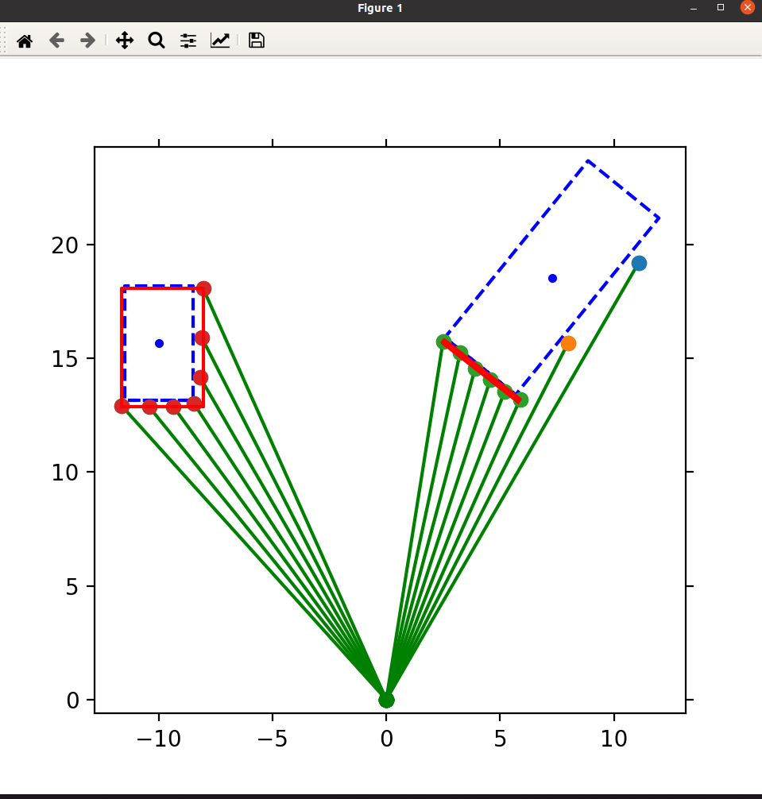

# rectanglefitting
A package from AtsushiSakai. Full repository can be referred here: 
https://github.com/aizzat/PythonRobotics

# How to run: 

1. Create virtual env in conda - use pytho 3.9
2. Install package in requirement the requirements.txt
3. Run the rectangle fitting python file
4. Sample real lidar scan data ox.csv and oy.csv are provided - you can use the lidar scan by modifying the original rectangle fitting file to take input from the csv file.

# Screenshot: 

